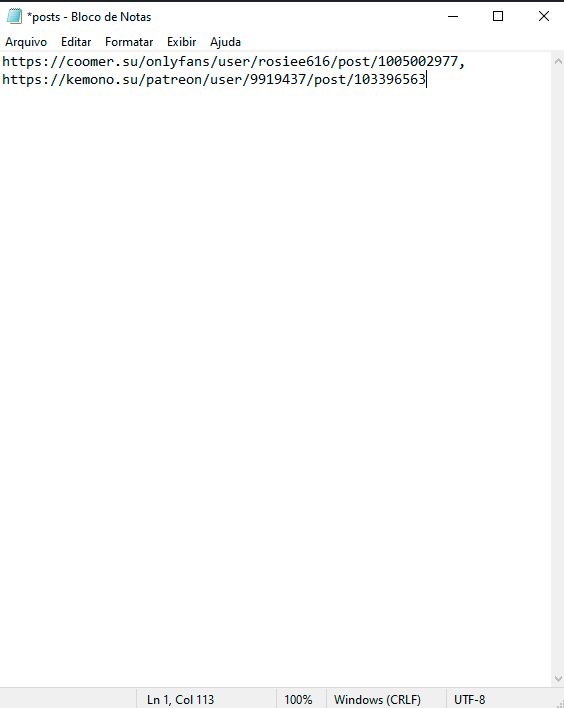
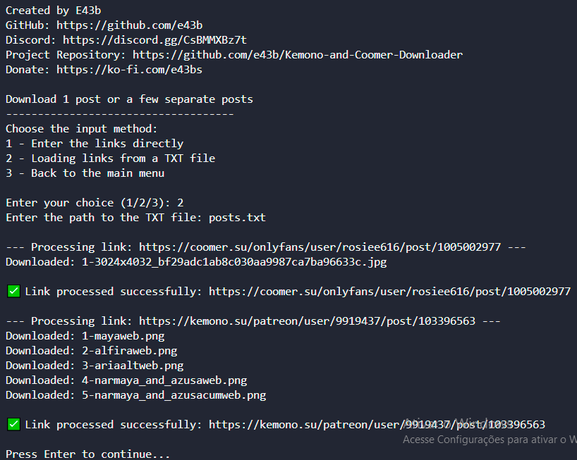
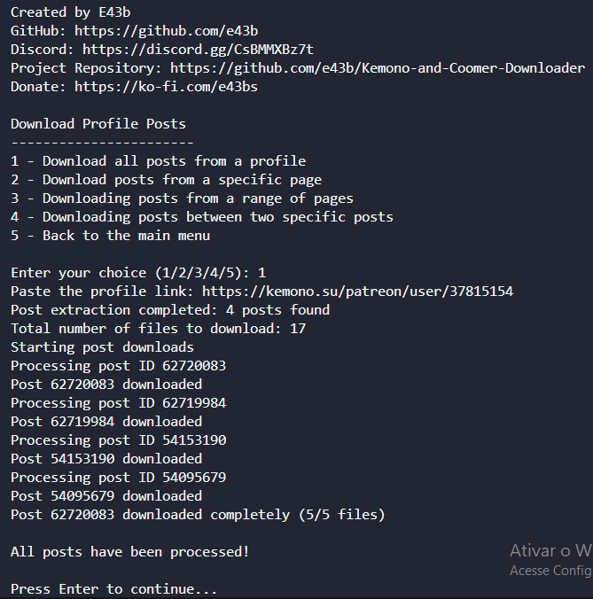
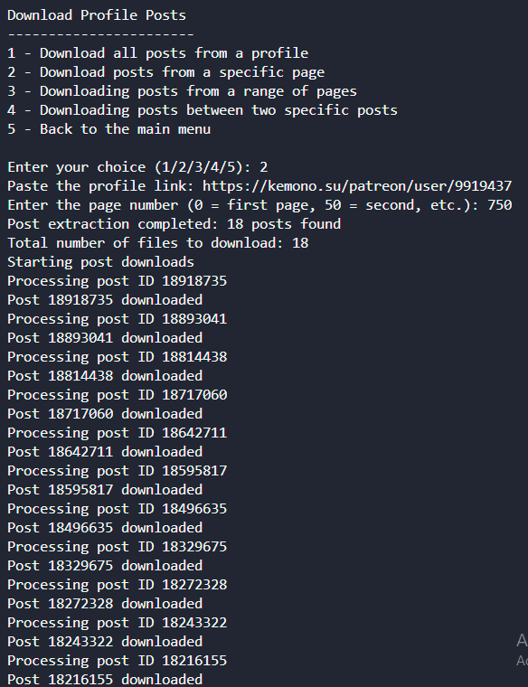
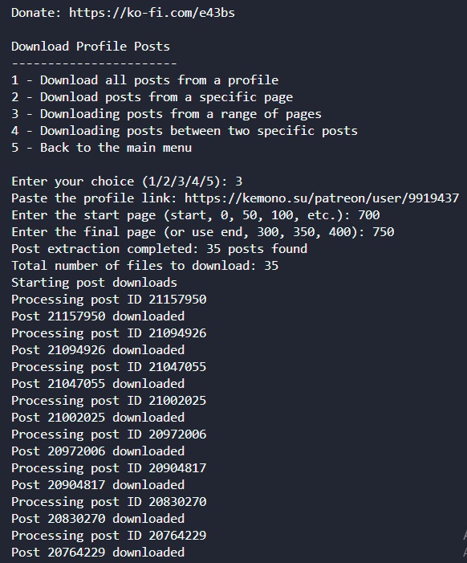
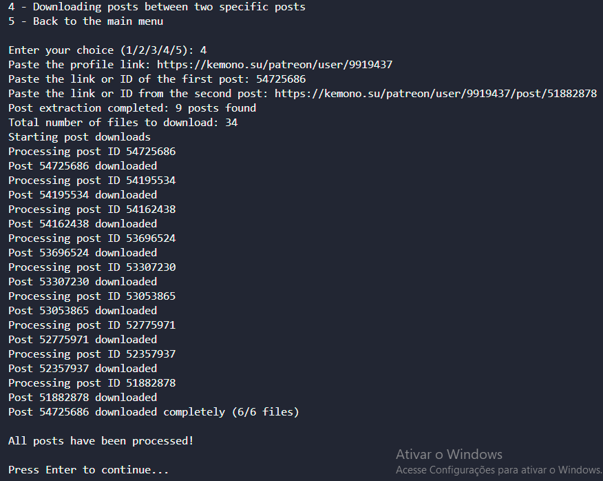
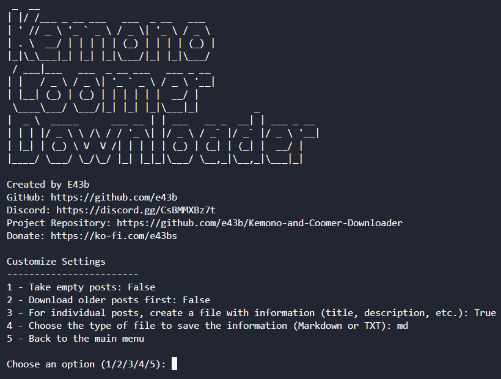
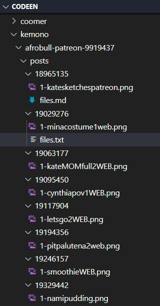
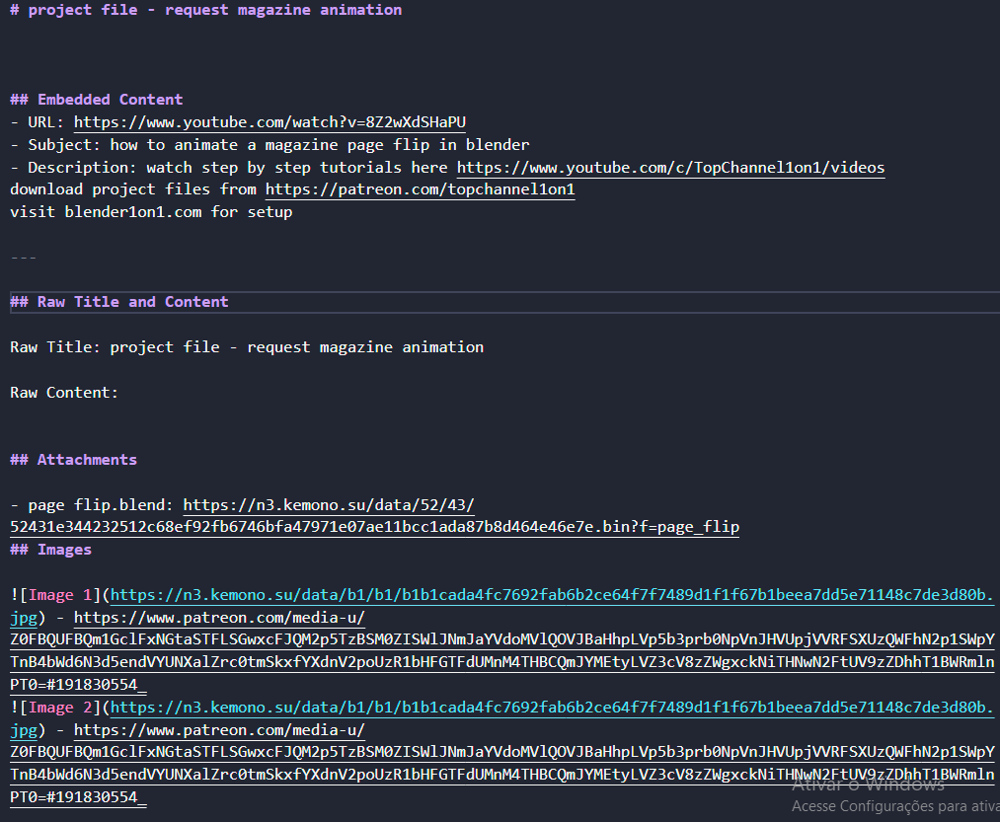

# Kemono and Coomer Downloader

[](https://github.com/e43b/Kemono-and-Coomer-Downloader/)

[ English](README.md) | [ Português](README-ptbr.md)

O **Kemono and Coomer Downloader** é uma ferramenta que permite baixar posts dos sites [Kemono](https://kemono.su/) e [Coomer](https://coomer.su/).

Com essa ferramenta, é possível baixar posts únicos, múltiplos posts sequencialmente, baixar todos os posts de um perfil do Kemono ou Coomer.

## Apoie o Desenvolvimento da Ferramenta 💖

Esta ferramenta foi criada com dedicação para facilitar sua vida e é mantida de forma independente. Se você acha que ela foi útil e gostaria de contribuir para sua melhoria contínua, considere fazer uma doação.

Toda ajuda é bem-vinda e será usada para cobrir custos de manutenção, melhorias e adição de novos recursos. Seu apoio faz toda a diferença!

[](https://ko-fi.com/e43bs)

### Por que doar?
- **Manutenção contínua**: Ajude a manter a ferramenta sempre atualizada e funcionando.
- **Novos recursos**: Contribua para a implementação de novas funcionalidades solicitadas pela comunidade.
- **Agradecimento**: Mostre seu apoio ao projeto e incentive o desenvolvimento de mais ferramentas como esta.

🎉 Obrigado por considerar apoiar este projeto!

## Star History

[](https://star-history.com/#e43b/Kemono-and-Coomer-Downloader&Date)

## Como Usar

1. **Certifique-se de ter o Python instalado em seu sistema.**
2. **Clone este repositório:**
```sh
git clone https://github.com/e43b/Kemono-and-Coomer-Downloader/
```

3. **Navegue até o diretório do projeto:**
```sh
cd Kemono-and-Coomer-Downloader
```

4. **Selecione o idioma desejado:**
   - A pasta codeen contém a versão em inglês.
   - A pasta codept contém a versão em português.

5. **Execute o script principal:**
```sh
python main.py
```

6. **Siga as instruções no menu para escolher o que deseja baixar ou personalizar o programa.**

## Bibliotecas

A biblioteca necessária é: requests. Ao iniciar o script pela primeira vez, se a biblioteca não estiver instalada, será instalada automaticamente.

## Funcionalidades

### Página Inicial

A página inicial do projeto apresenta as principais opções disponíveis para facilitar a utilização da ferramenta.


### Baixar Post

#### Opção 1: Download de 1 Post ou Alguns Posts Separados

##### 1.1 Inserir os links diretamente

Para baixar posts específicos, insira os links dos posts separados por vírgula. Esta opção é ideal para baixar poucos posts. Exemplo:

```sh
https://coomer.su/onlyfans/user/rosiee616/post/1005002977, https://kemono.su/patreon/user/9919437/post/103396563
```


##### 1.2 Carregar links de um arquivo TXT

Se você possui vários links de posts para baixar, facilite o processo utilizando um arquivo `.txt`. 

###### Passo 1: Criando o Arquivo TXT

1. Abra um editor de texto de sua preferência (como Notepad, VS Code, ou outro).
2. Liste os links dos posts no seguinte formato:
   - Separe os links por **vírgulas**.
   - Exemplo de conteúdo do arquivo:
```sh
https://coomer.su/onlyfans/user/rosiee616/post/1005002977, https://kemono.su/patreon/user/9919437/post/103396563
```
3. Salve o arquivo com a extensão `.txt`. Por exemplo: `posts.txt`.

###### Passo 2: Localizando o Caminho do Arquivo

Você pode especificar o caminho do arquivo ao script de duas maneiras:

1. **Caminho Absoluto**: Localize o arquivo no seu sistema e copie o caminho completo.
```sh
C:\Users\SeuUsuario\Documentos\posts.txt
```

2. **Caminho Relativo**: Se o arquivo estiver na mesma pasta que o script `main.py`, basta informar o nome do arquivo.
```sh
posts.txt
```

###### Passo 3: Executando o Script

1. Cole o caminho do arquivo TXT no console.
2. O script iniciará o download automaticamente e processará todos os links listados no arquivo.

###### Conteúdo do Arquivo TXT



###### Script em Execução



##### 1.3 Voltar ao menu principal

Selecione esta opção para retornar ao menu inicial.

#### Opção 2: Download de Todos os Posts de um Perfil

⚠️ **Atenção Geral**:
Neste modo de download, **não será criado o arquivo `files.md`** com informações como título, descrição, embeds, etc.
Se você precisa dessas informações, utilize a **Opção 1**.

##### 2.1: Download de Todos os Posts de um Perfil

1. Insira o link de um perfil do Coomer ou Kemono.
2. Pressione **Enter**.

**Observações**:
- Este modo permite baixar todos os posts do perfil inserido.
- **Limitação**: Não é possível baixar mais de um perfil por vez.

O sistema irá processar o link, extrair todos os posts e realizar o download.



##### 2.2: Download de Posts de uma Página Específica

1. Insira o link de um perfil do Coomer ou Kemono.
2. Pressione **Enter**.
3. Informe o **offset** da página desejada.

**Como calcular o offset**:
- Tanto no Kemono quanto no Coomer, os offsets aumentam de 50 em 50:
  - Página 1: offset = 0
  - Página 2: offset = 50
  - Página 3: offset = 100
  - ...
- Para encontrar o offset da página desejada:
  1. Acesse a página do perfil.
  2. Clique na página desejada e observe o número no final do link.
     Exemplo:
```
https://kemono.su/patreon/user/9919437?o=750
```
Nesse caso, o offset é **750**.

O sistema irá processar a página especificada, extrair os posts e realizar o download.



##### 2.3: Download de Posts em um Intervalo de Páginas

1. Insira o link de um perfil do Coomer ou Kemono.
2. Pressione **Enter**.
3. Informe o **offset** da página inicial.
4. Informe o **offset** da página final.

**Como calcular os offsets**:
- O cálculo do offset segue a mesma lógica da **Opção 2.2**.
  - Exemplo:
    - Página 1: offset = 0
    - Página 16: offset = 750

Todos os posts entre os offsets especificados serão extraídos e baixados.



##### 2.4: Download de Posts entre Dois Posts Específicos

1. Insira o link de um perfil do Coomer ou Kemono.
2. Pressione **Enter**.
3. Insira o link ou o ID do **post inicial**.
   - Exemplo de link:
```
https://kemono.su/patreon/user/9919437/post/54725686
```
   - Apenas o ID: `54725686`.
4. Insira o link ou o ID do **post final**.

**O que acontece**:
O sistema fará o download de todos os posts entre os dois IDs especificados.



##### 2.5: Voltar ao Menu Principal

Selecione esta opção para retornar à página inicial.

#### Opção 3: Personalizar as Configurações do Programa

Essa opção permite configurar algumas preferências no programa. As opções disponíveis são as seguintes:

1. **Take empty posts**: `False`
2. **Download older posts first**: `False`
3. **For individual posts, create a file with information (title, description, etc.)**: `True`
4. **Choose the type of file to save the information (Markdown or TXT)**: `md`
5. **Back to the main menu**

##### Descrição das Opções

###### Take Empty Posts
- Define se posts vazios (sem arquivos anexos) devem ser incluídos nos downloads massivos de perfis.
  - **False (Recomendado)**: Posts vazios serão ignorados.
  - **True**: Será criada uma pasta para os posts vazios. Use essa opção apenas em casos específicos.

###### Download Older Posts First
- Controla a ordem de download dos posts em perfis:
  - **False**: Baixa os posts mais recentes primeiro.
  - **True**: Baixa os posts mais antigos primeiro.

###### Criar Arquivo com Informações (Posts Individuais)
- Define se será criado um arquivo contendo informações como título, descrição e embeds ao baixar posts individualmente:
  - **True**: Cria o arquivo informativo.
  - **False**: Não cria o arquivo.

###### Tipo de Arquivo para Salvar Informações
- Escolha o formato do arquivo criado nas **Opções Individuais**:
  - **Markdown (`md`)**: Arquivo no formato Markdown.
  - **TXT (`txt`)**: Arquivo no formato texto simples.
  - **Nota**: Ambos os formatos utilizam estrutura Markdown.

###### Como Alterar as Configurações
Para modificar qualquer uma das opções, basta digitar o número correspondente. O programa alternará automaticamente o valor entre as opções disponíveis (por exemplo, de `True` para `False`).



#### Opção 4: Sair do Programa

Essa opção encerra o programa.

## Organização dos Arquivos

Os posts são salvos em pastas para facilitar a organização. A estrutura de pastas segue o padrão abaixo:

### Estrutura das Pastas

1. **Plataforma**: Uma pasta principal é criada para cada plataforma (Kemono ou Coomer).
2. **Autor**: Dentro da pasta da plataforma, é criada uma pasta para cada autor no formato **Nome-Serviço-Id**.
3. **Posts**: Dentro da pasta do autor, há uma subpasta chamada `posts` onde os conteúdos são organizados.
   Cada post é salvo em uma subpasta identificada pelo **ID do post**.

### Exemplo da Estrutura de Pastas

```
Kemono-and-Coomer-Downloader/
│
├── kemono/                                 # Pasta da plataforma Kemono
│   ├── Nome-Serviço-Id/                    # Pasta do autor no formato Nome-Serviço-Id
│   │   ├── posts/                          # Pasta de posts do autor
│   │   │   ├── postID1/                    # Pasta do post com ID 1
│   │   │   │   ├── conteudo_do_post        # Conteúdo do post
│   │   │   │   ├── files.md                # (Opcional) Arquivo com informações dos arquivos
│   │   │   │   └── ...                     # Outros arquivos do post
│   │   │   ├── postID2/                    # Pasta do post com ID 2
│   │   │   │   ├── conteudo_do_post        # Conteúdo do post
│   │   │   │   └── files.txt               # (Opcional) Arquivo com informações dos arquivos
│   │   │   └── ...                         # Outros posts
│   │   └── ...                             # Outros conteúdos do autor
│   └── Nome-Serviço-Id/                    # Pasta de outro autor no formato Nome-Serviço-Id
│       ├── posts/                          # Pasta de posts do autor
│       └── ...                             # Outros conteúdos
│
└── coomer/                                 # Pasta da plataforma Coomer
    ├── Nome-Serviço-Id/                    # Pasta do autor no formato Nome-Serviço-Id
    │   ├── posts/                          # Pasta de posts do autor
    │   │   ├── postID1/                    # Pasta do post com ID 1
    │   │   │   ├── conteudo_do_post        # Conteúdo do post
    │   │   │   ├── files.txt               # (Opcional) Arquivo com informações dos arquivos
    │   │   │   └── ...                     # Outros arquivos do post
    │   │   └── postID2/                    # Pasta do post com ID 2
    │   │       ├── conteudo_do_post        # Conteúdo do post
    │   │       └── ...                     # Outros arquivos do post
    │   └── ...                             # Outros conteúdos do autor
    └── Nome-Serviço-Id/                    # Pasta de outro autor no formato Nome-Serviço-Id
        ├── posts/                          # Pasta de posts do autor
        └── ...                             # Outros conteúdos
```



### Sobre o Arquivo `files.md` ou `files.txt`

O arquivo `files.md` (ou `files.txt`, dependendo da configuração escolhida) contém as seguintes informações sobre cada post:
- **Título**: O título do post.
- **Descrição/Conteúdo**: O conteúdo ou descrição do post.
- **Embeds**: Informações sobre elementos incorporados (se houver).
- **Links de Arquivos**: URLs de arquivos presentes nas seções de **Attachments**, **Videos**, e **Images**.



## Contribuições

Este projeto é **open-source**, e sua participação é muito bem-vinda! Se você deseja ajudar no aprimoramento da ferramenta, sinta-se à vontade para:

- **Enviar sugestões** para novos recursos ou melhorias.
- **Relatar problemas** ou bugs encontrados.
- **Submeter pull requests** com suas próprias contribuições.

Você pode contribuir de diversas maneiras através do nosso [repositório no GitHub](https://github.com/e43b/Kemono-and-Coomer--Downloader/) ou interagir com a comunidade no nosso [Discord](https://discord.gg/GNJbxzD8bK).

## Autor

O **Kemono and Coomer Downloader** foi desenvolvido e é mantido por [E43b](https://github.com/e43b). Nosso objetivo é tornar o processo de download de posts nos sites **Kemono** e **Coomer** mais simples, rápido e organizado, proporcionando uma experiência fluída e acessível para os usuários.

## Suporte

Se você encontrar problemas, bugs ou tiver dúvidas, nossa comunidade está pronta para ajudar! Entre em contato pelo nosso [Discord](https://discord.gg/GNJbxzD8bK) para obter suporte ou tirar suas dúvidas.
