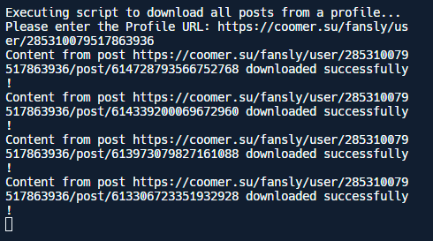

# Kemono and Coomer Downloader  [](https://github.com/e43b/Anibunker-Downloader/)

###### [ English](README.md) | [ Português](README-ptbr.md)

The **Kemono and Coomer Downloader** is a tool that allows you to download posts from the [Kemono](https://kemono.su/) and [Coomer](https://coomer.su/) websites.

With this tool, you can download single posts, multiple posts sequentially, download all posts from a profile, and download all DMs from a Kemono profile. You can also configure what you want to save in the posts: attachments, videos, create a `.txt` file with information about the post, among others. For more information, visit the [documentation](https://github.com/e43b/Kemono-and-Coomer-Downloader/blob/main/codeen/doc.md).

## How to Use

1. **Make sure you have Python installed on your system.**
2. **Clone this repository:**

    ```sh
    git clone https://github.com/e43b/Kemono-and-Coomer-Downloader/
    ```

3. **Navigate to the project directory:**

    ```sh
    cd Kemono-and-Coomer-Downloader
    ```

4. **Select the desired language:**

    - The `codeen` folder contains the English version.
    - The `codept` folder contains the Portuguese version.

5. **Run the main script:**

    ```sh
    python main.py
    ```

6. **Follow the instructions in the menu to choose what you want to download or customize the program.**

## Libraries

The required libraries are: `requests` and `beautifulsoup4`. When running the script for the first time, if the libraries are not installed, you will be prompted to install them. Just type "s" and they will be installed automatically.


## Features

### Home Page

The project homepage presents the main options available to facilitate the use of the tool.


### Download Post

To download specific posts, just enter the post link. If you want to download multiple posts, separate the links with a comma. Example:

```sh
https://kemono.su/patreon/user/133054/post/82477856 , https://coomer.su/fansly/user/285310079517863936/post/614339200069672960 , https://coomer.su/fansly/user/285310079517863936/post/611301068940255234
```


### Download All Posts from a Profile

Enter the link of a Kemono or Coomer profile, and the script will start downloading all posts that match the program configuration for downloading all posts from a profile.



### Download DMs

This only works for profiles on the Kemono website, as Coomer does not have this feature. Just put the profile link, and all DMs will be extracted in `.txt` format and saved in the `dm` folder.


## File Organization

Posts are saved in folders for easier organization. The folder structure is as follows:

1. **Platform:** A main folder is created for the platform (Kemono or Coomer).
2. **Author:** Inside the platform folder, a folder is created for each author.
3. **Posts:** Inside the author's folder, there is a `posts` folder where posts are saved. Each post is saved in a subfolder identified by the post ID.
4. **DMs:** Inside the author's folder, there is also a `DMs` folder where the `.txt` DM files are saved.

Example of the folder structure:

```
Kemono-and-Coomer-Downloader/
│
├── kemono/                               # Kemono platform folder
│   ├── author1/                          # Author 1 folder
│   │   ├── posts/                        # Posts folder for author 1
│   │   │   ├── postID1/                  # Post folder with ID 1
│   │   │   │   ├── post_content          # Post content
│   │   │   │   └── ...                   # Other post files
│   │   │   └── postID2/                  # Post folder with ID 2
│   │   │       ├── post_content          # Post content
│   │   │       └── ...                   # Other post files
│   │   └── DMs/                          # DMs folder for author 1
│   │       ├── dm1.txt                   # DM 1
│   │       ├── dm2.txt                   # DM 2
│   │       └── ...                       # Other DMs
│   └── author2/                          # Author 2 folder
│       ├── posts/                        # Posts folder for author 2
│       └── DMs/                          # DMs folder for author 2
│
└── coomer/                               # Coomer platform folder
    ├── author1/                          # Author 1 folder
    │   ├── posts/                        # Posts folder for author 1
    │   └── DMs/                          # DMs folder for author 1 (if applicable)
    └── author2/                          # Author 2 folder
        ├── posts/                        # Posts folder for author 2
        └── DMs/                          # DMs folder for author 2 (if applicable)
```


## Configuration

The configuration page allows you to customize the program according to your needs.


### Post Configuration

In the post configuration mode, the user can set several options, including:

- **Download Attachments:** Choose whether or not to download attachments.
- **Download Videos:** Choose whether to download videos when available.
- **Save Information:** Save information in a `.txt` file, such as title, post date, import date, and content.
- **Save Comments:** Save post comments in the `.txt` file. To save comments, the save information option must be enabled.


### Profile Configuration

In profile configuration mode, the user can set what they want to download from the posts, similar to the post configuration options. The difference is that the user can filter by posts that have or do not have images, choosing one or the other, or both versions.


For more details, refer to the [documentation](https://github.com/e43b/Kemono-and-Coomer-Downloader/blob/main/codeen/doc.md).

## Contributions

This project is open source, and you are encouraged to contribute improvements and new features. Feel free to send suggestions, report issues, or submit pull requests through the [official GitHub repository](https://github.com/e43b/Kemono-and-Coomer-Downloader/) or through our [Discord](https://discord.gg/TaPhfXawcE).

## Author

Developed and maintained by [E43b](https://github.com/e43b), the Kemono and Coomer Downloader aims to simplify the process of downloading posts from the Kemono and Coomer websites, providing a more accessible and organized experience.

## Support

If you encounter problems, find bugs, or have any questions, visit our [Discord](https://discord.gg/TaPhfXawcE) for help and support.

## Links

- **Project Repository:** [https://github.com/e43b/Kemono-and-Coomer-Downloader/](https://github.com/e43b/Kemono-and-Coomer-Downloader/)
- **Kemono Site:** [https://kemono.su/](https://kemono.su/)
- **Coomer Site:** [https://coomer.su/](https://coomer.su/)

---

### Support the Project

If you find this tool useful and would like to support its continued development, consider making a donation. Your contribution helps keep the project active and develop new features.

#### Make a donation by accessing [this link](https://oxapay.com/donate/40874860).

---

We hope this tool is useful to you!
